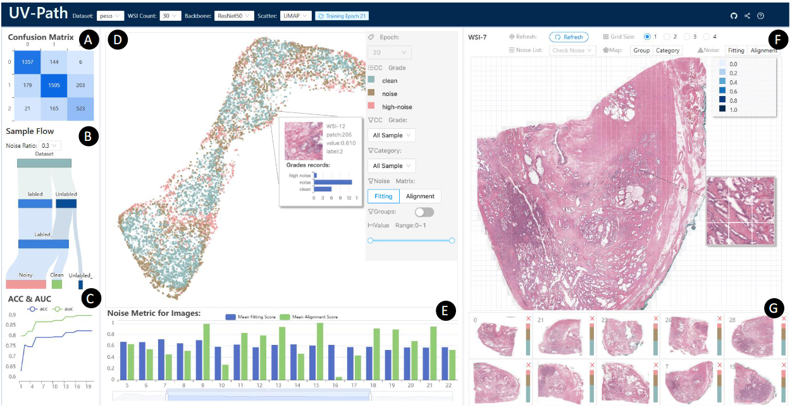

# UV-Path

UV-Path, an interactive  $\textcolor{green}{U}ncertainty-aware$ $\textcolor{blue}{V}isualization$ framework that facilitates $\textcolor{orange}{A}ctive \textcolor{red}{L}earning$ for deep learning-based histo$\textcolor{red}{Path}$ological image analysis. **UV-Path** includes a noise-hard sample monitoring module, which allows experts to review samples and intervene in the model outcomes during the active learning (AL) process, enhancing both learning performance and transparency. 

The related paper, "UV-Path: Uncertainty-aware Visual Analytics for Weakly Supervised Learning on Histopathological Images," has been submitted to VIS 2023.



___

In addition, we show some related GIFs for demonstration.

- 

# Datasets

We used two publicly available datasets: [PESO](https://zenodo.org/record/1485967#.Yz2NbuzMJ_A) and [Hubmap](https://www.kaggle.com/competitions/hubmap-organ-segmentation/data?select=train.csv).

- PESO (cancer classification):  A large set of WSI of prostatectomy specimens with various grades of prostate cancer. All the WSIs are stained with H&E and nearly 10,000×10,000 pixels. 

~~~
|_ datasets
    |     |_ peso/
    |         |_ init_data/
    |             |_ train_dataset.npy/
    |             |_ test_dataset.npy/
    |             |_ init_labeled_set.npy/
    |             |_ init_unlabeled_set.npy/
    |             |_ bk_dataset.npy/
    |         |_ init_data_image/
    |             |_ image_0/
    |                 ...
    |             |_ image_29/
~~~

- Hubmap (cancer segmentation):  The slides in the dataset are all 3000 x 3000 pixels, and the tissue area in each image is approximately 2500 x 2500 pixels and prepared with the periodate-Schiff (PAS)/hematoxylin and eosin (H&E) staining method. 

```
|_ datasets
    |     |_ hubmap/
    |         |_ 1000_pixel_images/
    |             |_ train/
    |             |_ masks/
```

## Generating `.npy` files and tiling WSIs for visualization

Training our model with PESO dataset requires inputs in `.npy` format. 

1. Open python file: `cut_slider.py`
2. Configure each `path` according to your environment and set `img_num` to determine the number of WSIs you need.
3. Run this python file by typing `python cut_slider.py`,where 

> `init_peso_WSI_train_percent` i s used to tile WSIs from PESO dataset according to cancer ratio in each patch. `npy_data_init_percent` is the corresponding function used to generate each `.npy` file.

But for the Hubmap dataset, you need to do a simple pre-processing.

1. Convert 3000 ×3000 resolution WSIs to a model-recognizable size of 1024 ×1024.
2.  The sliced masks contained in the corresponding region can be extracted from the `.csv` file in the dataset.
3. Generate `train` and `masks` folders and individual regions accordingly.

# How to start ?

The **UV-Path** project contains two parts: `Server` and  `Visual`.

- `Sever` is  a lightweight backend service based on python [Flask](https://flask.palletsprojects.com/en/2.2.x/).  Its main functions are 1) calculating the iterative results of the model and storing them in a `.csv` files and 2) displaying the visual solution we designed in the front-end page via web requests.
- `Visual` is a [React](https://react.dev/) app, its showcases the various visual solutions we have designed (see our paper).

Before starting UV-Path, make sure that [python](https://www.python.org/) (>=3.7) with [Flask](https://flask.palletsprojects.com/en/2.2.x/) >= 2.1.0 and [node.js]([nodejs.org](https://nodejs.org/en)) have been installed.

For starting ` Flask Server`, you can simply typing

```
cd ./Server
python main.py
```

For using `Visual`, you need to install download the relevant dependency packages by typing

```
cd ./Visual
npm install / yarn
```

 To start the `Visual`, further run

```
npm start / yarn start
```

Then navigate to `http://localhost:3000/` in your browser to see **UV-Path** .

# Critations

```
...
```


